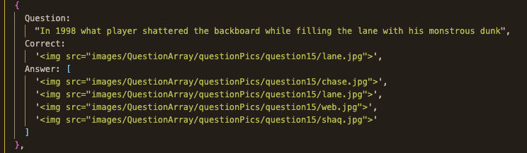
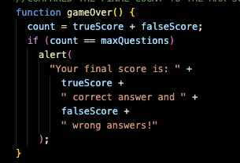
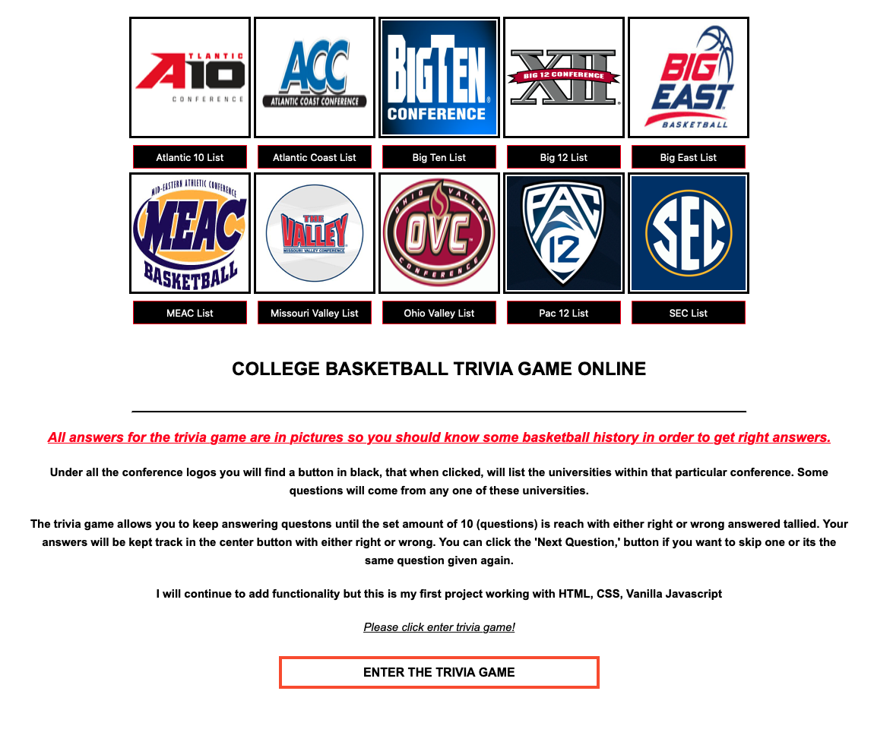
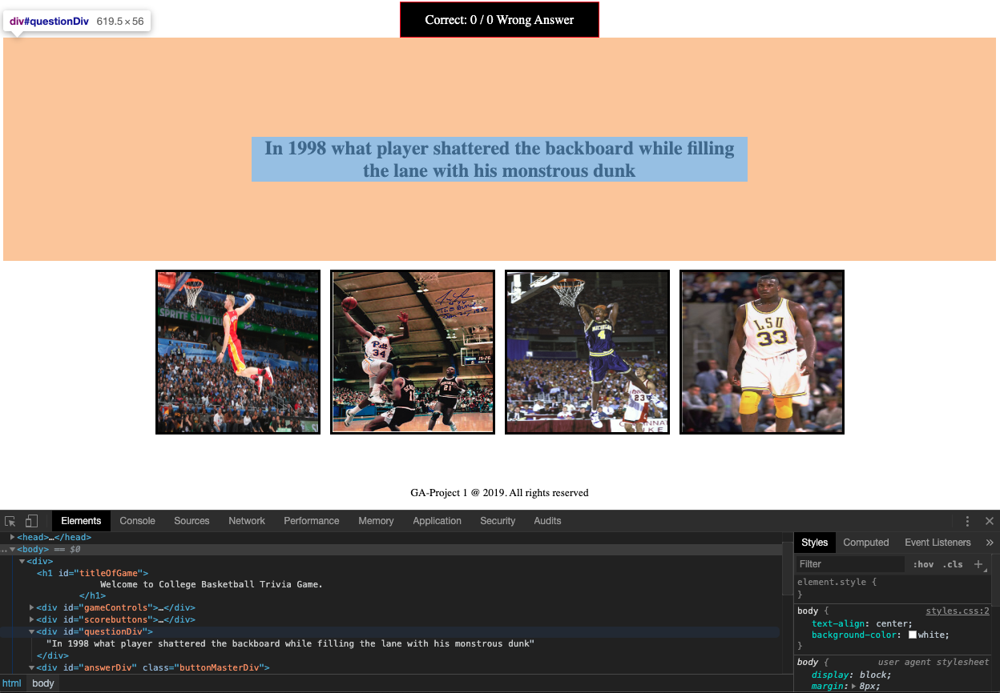

# Project 1 College Basketball Trivia Game

The College Basketball trivia game project is a simple click through of random questions and answers. You will be given ten questions and four answers to choose from for each question. The scoring is done in the following format; click the correct answer your score goes up in increments of one. If you click a incorrect answers it either decreases your score or the score goes negative number.

After receiving 10 correct answers the player wins and the games end.

# Motivation:

My love of sports, specifically basketball, motivated me to do this project.  As my first project I think I did a pretty good job blending javascript with HTML and CSS.  I will continue to improve on the functionality and the UI on my project. I want to add a difficulty level to the question which would result in a higher score (for example a 3-pointer question). 

# Brief Example Score Explanation:

This is just two examples of the positive and negative numbers on your score depending on what I click for the answers. If your score shows negative, such at the picture (-7), you will have to click 7 times then another 10 positive to win.

# Code style

No coding styles used. However, here is a snip of the array of objects used for question and answer.

Currently, the game ends when the player gets 10 points. I need to improve this part of the code function and end the game after the user completes ten questions ( no consideration whether the question is incorrect or correct). 

# List of Technologies Used:

Visual Studio Code - IDE
Javascript (vanilla)
HTML
CSS
MacBook Pro / Catalina 10.15.1

\***\* Still need to finish a couple features on project \*\***

# Features of Project

Landing page have ten (10) modals on it with all teams from each division. Once click on button it will pop up.

Modal buttons above.

Modal pop up below.

Code files below:

Modal code below:

# Screenshots of project

# Testing Code:

Testing the first button on landing page to make sure it linked to my game page.  

The test of my random question as well. I provide screenshots of testing the next question chosen randomly, each answer (first, second, third, forth). Also the console.log for you. 16 is the random question pulled out of the array of object.

# How to Use

click enter game button and go through it.  

# Contribute Guidelines

clone project to local machine and use. Students that are learning and clone and read code and figure out how it was put together or improve for themselves. 

# Credits

I learned modals reading GA specification, researching google, as well as youtube.

https://www.youtube.com/watch?v=6ophW7Ask_0
https://www.w3schools.com/howto/howto_css_modals.asp
https://medium.com/@nerdplusdog/a-how-to-guide-for-modal-boxes-with-javascript-html-and-css-6a49d063987e

Readme File Credits: 
https://medium.com/@meakaakka/a-beginners-guide-to-writing-a-kickass-readme-7ac01da88ab3

GA documentation as well. 