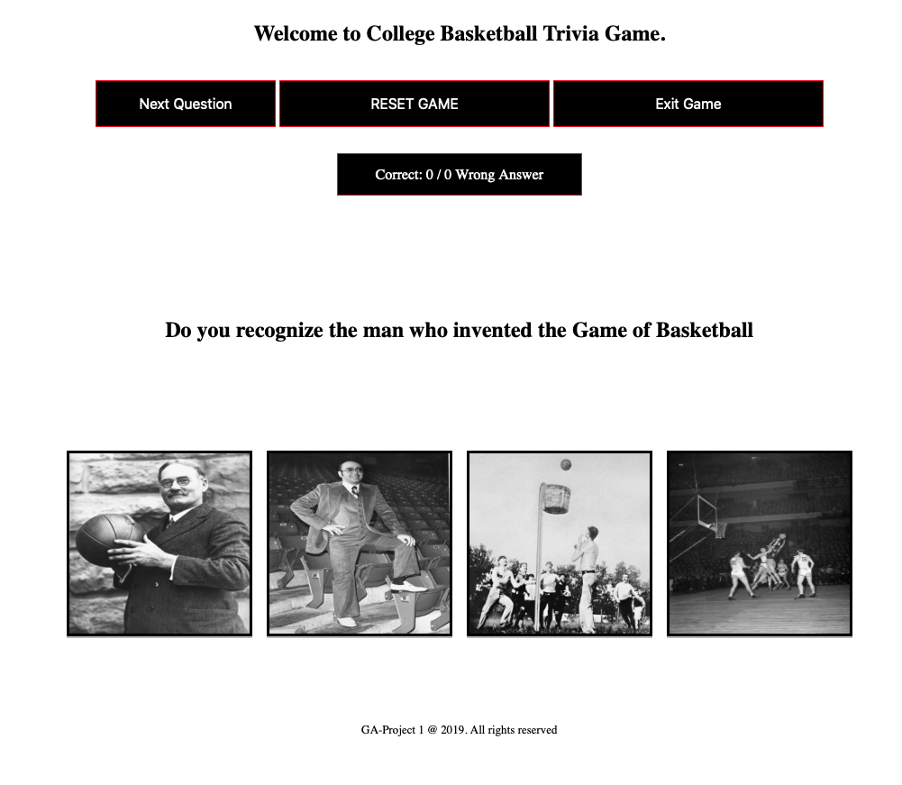

# Project 1 College Basketball Trivia Game

The College Basketball trivia game project is a simple click through of answers and questions. You will be given ten question with a choice or four answers to choose from for each question. The scoring is done in the following format; Click a positive number your socre goes to a position number. If you click a negative answers it either decreases or is a negative number.

You have to obtain ten positive answers and you win.

# Motivation:

I was motivated to do this project because I wanted to try something I never did before. As my first project I think I did a pretty good job on the front end and back end. I will continue to improve on the project throughout it being posted on github.

# Brief Example Score Explanation:

This is just two examples of the positive and negative numbers on your score depending on what I click for the answers. If your score shows negative, such at the picture (-7), you will have to click 7 times then another 10 positive to will.

# Code style

No coding styles used. However, here is a snip of my array of objects used for question and answer.

Where I need to improve my code is within this function to fix the output of only ten question to use instead of constantly going through the questions repeatedly.

# List of Technologies Used:

Visual Studio Code - IDE
Javascript (vanilla)
HTML
CSS
MacBook Pro / Catalina 10.15.1

\***\* Still need to finish a couple features on project \*\***

# Features of Project

Landing page have ten (10) modals on it with all teams from each division. Once click on button it will pop up.

Modal buttons above.

Modal pop up below.

Code files below:

Modal code below:

# Screenshots of project

# Testing Code: 

Testing the first button on landing page to make sure it linked to my game page.  

